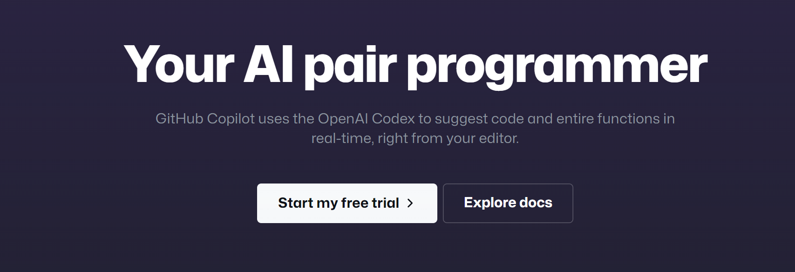
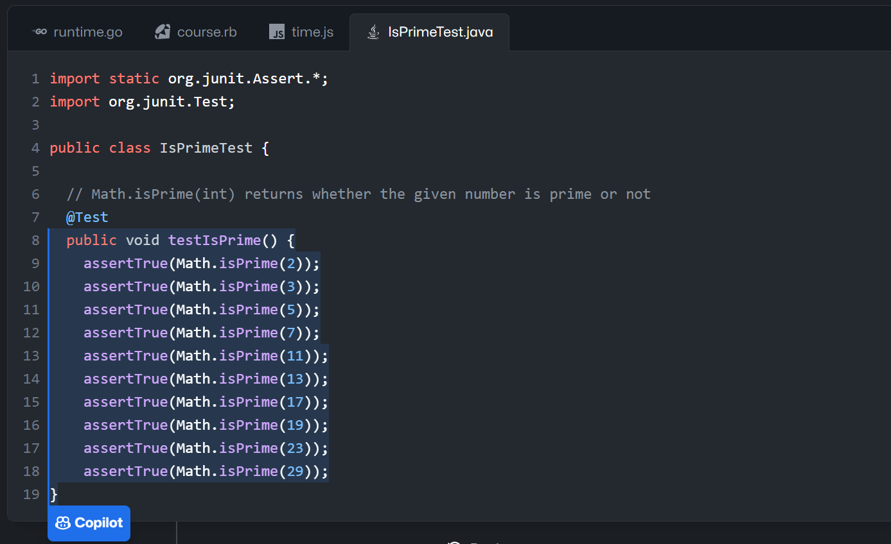
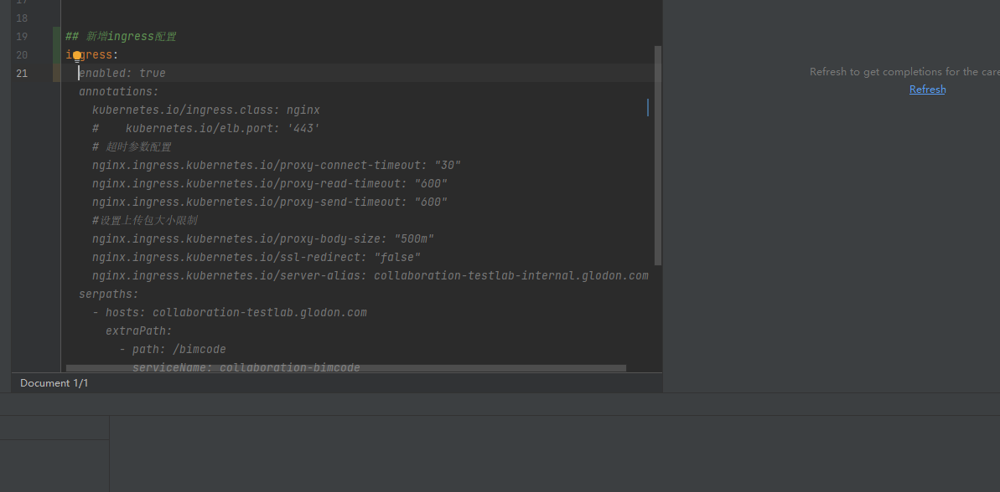
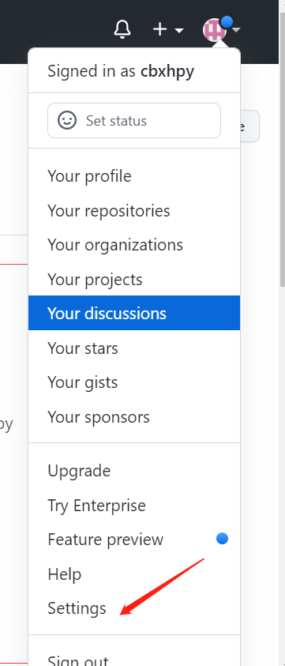
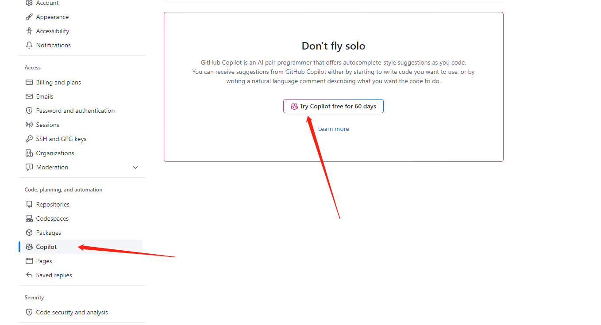
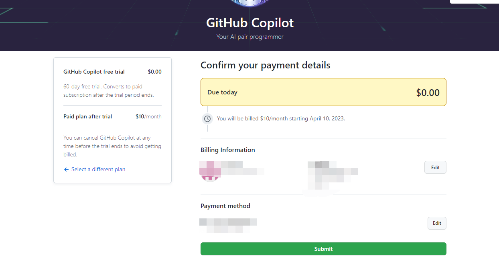
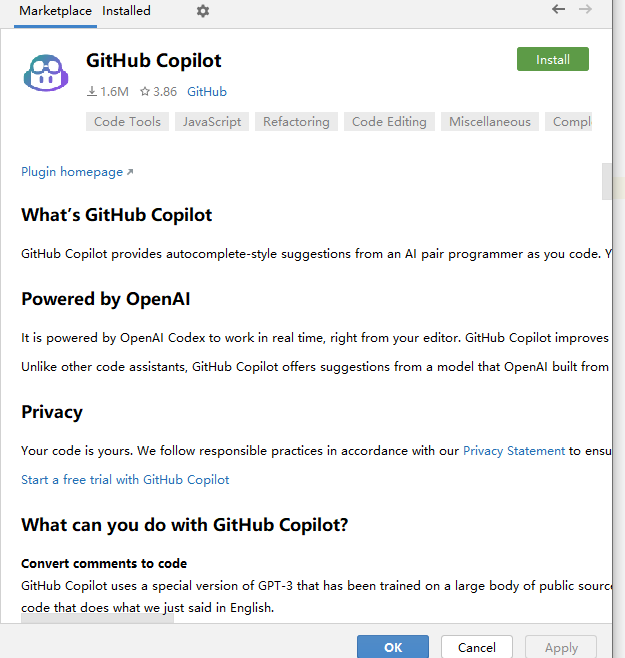
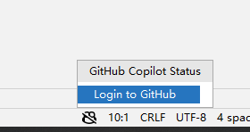
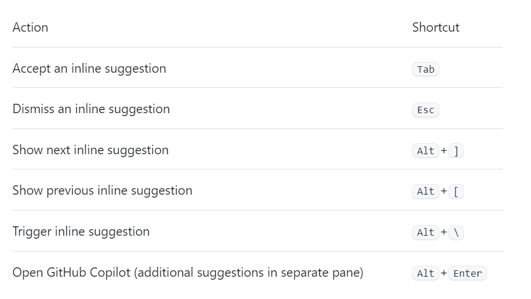

# 初尝 Copilot
## 1.什么是 Copilot
Copilot 是一个 AI 代码生成工具，可以帮助开发者快速生成代码，提高开发效率。

官网: https://copilot.github.com/

 从上面可以看得出来，官方将其定义为：**编程伙伴**，而不是代码生成器，这是一个很好的定义。
 
>因为它不是一个代码生成器，而是一个代码提示工具，它可以帮助我们实时快速生成代码。
当然我们还是需要自己去修改代码，这样才能达到最好的效果。

## 2.先上效果
## 2.1 先看官方效果

## 2.1 自己的代码  
~~~~~~~~~~**诚不欺我**

## 3.上操作
    Copilot 是一个付费服务，需要注册账号，然后开通服务。
### 3.1 注册账号
#### 3.1.1 登录 https://github.com/ 进入settings

#### 3.1.2 填写支付信息 VISA 或者 Paypal

#### 3.1.3 账号设置成功了。

 
## 3.2 配置 copilot
这里以 IDEA 为例

#### 3.2.1 进入 IDEA按照插件

#### 3.2.2.登录账号

#### 3.2.3. 调整github 后登录 github 账号

## 4. 补一个快捷键
